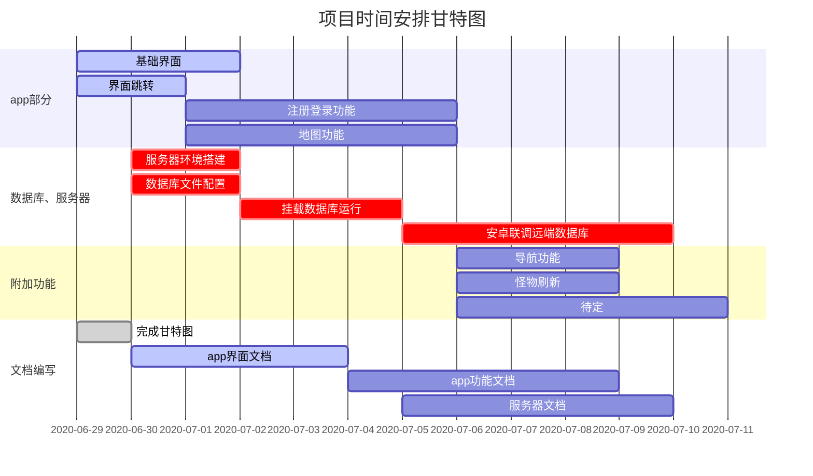
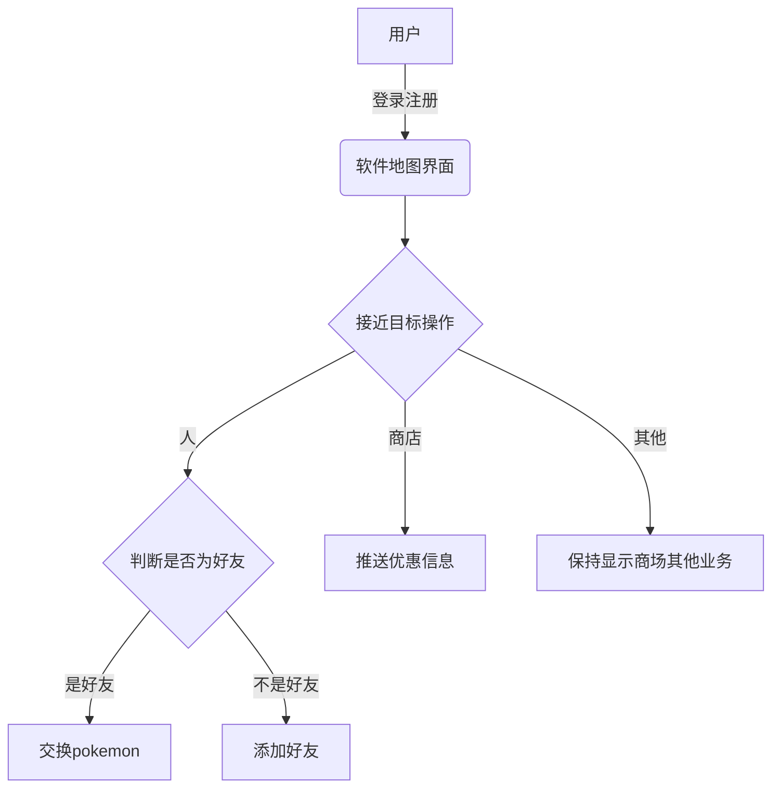

# wifi-position-game

提交测试

# 甘特图

```mermaid
gantt         
dateFormat  YYYY-MM-DD   
title 项目时间安排甘特图

section app部分
基础界面                :active,    des1, 2020-06-29,3d
界面跳转               :active,  des2, 2020-06-29, 2d
注册登录功能         :         des3, after des2, 5d
地图功能              :         des4, after des2, 5d

section 数据库、服务器
服务器环境搭建            :crit,  2020-06-30,2d
数据库文件配置         :crit, c2,2020-06-30, 2d
挂载数据库运行             :crit, c1,after c2,3d
安卓联调远端数据库        :crit, 5d

section 附加功能
导航功能               :a1, after des3, 3d
怪物刷新      :after des3  , 3d
待定    :after des3  , 5d

section 文档编写
完成甘特图               :done, a1,2020-06-29, 1d
app界面文档      :active,a2,after a1  , 4d
app功能文档 :after a2,5d
服务器文档    :doc1, after c1  , 5d
```
# 项目使用流程图

```mermaid
graph TD
A[用户] -->|登录注册| B(软件地图界面)
B --> C{接近目标操作}
C -->|人| D{判断是否为好友}
D -->|是好友| G[交换pokemon]
D -->|不是好友| H[添加好友]
C -->|商店| E[推送优惠信息]
C -->|其他| F[保持显示商场其他业务]
```

0630版本app

